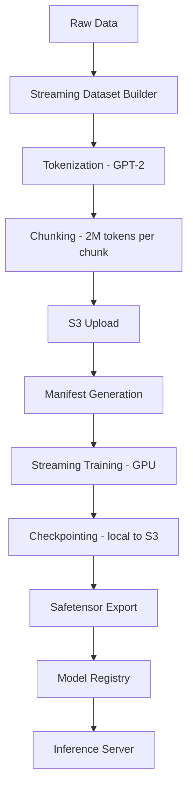
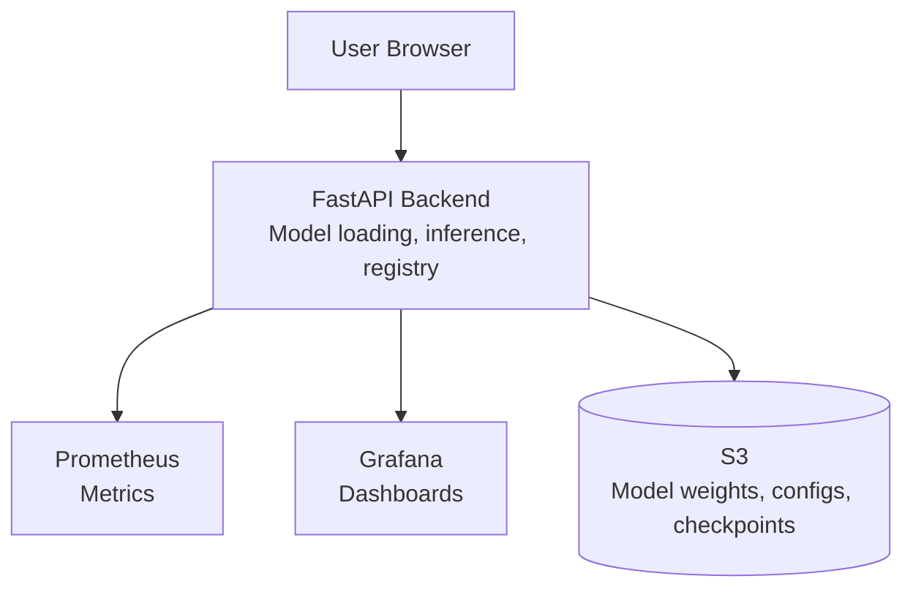

# LLM Serving Platform


A lightweight, end-to-end platform for training, managing, and serving decoder-only Large Language Models (LLMs). Built with simplicity and extensibility in mind, this platform allows you to train GPT-style models from scratch, monitor training, export weights, and deploy them for inference all with minimal friction.

---

## Table of Contents

- [Features](#features)
  - [Model Architecture](#model-architecture)
  - [Training Pipeline](#training-pipeline)
  - [Serving and Infrastructure](#serving-and-infrastructure)
- [Repository Structure](#repository-structure)
- [Quick Start](#quick-start)
- [Training Pipeline (Flow)](#training-pipeline-flow)
- [Training Configuration](#training-configuration)
- [Checkpointing and S3 Integration](#checkpointing-and-s3-integration)
- [Monitoring Stack](#monitoring-stack)
- [Deployment Architecture](#deployment-architecture)
- [What Has Been Trained](#what-has-been-trained)
- [Requirements](#requirements)
- [Roadmap](#roadmap)
- [License](#license)

---

## Features

### Model Architecture
- Decoder-only Transformer
- Multi-Head Causal Self-Attention
- Rotary Positional Embeddings (RoPE)
- Flash Attention support
- KV Cache and Ring KV Cache
- Configurable activation functions (GELU, ReLU, SiLU, Tanh)
- Layer Normalization
- SafeTensor export

### Training Pipeline
- GPT-2 tokenizer integration
- Streaming dataset builder (supports Wikipedia, Healix-Shot, and others)
- Non-overlapping sequence chunking (configurable)
- Cross-Entropy loss with ignore_index
- Validation loss and Perplexity tracking
- Gradient accumulation and clipping
- Automatic Mixed Precision (AMP)
- Cosine annealing learning rate scheduler
- Automatic checkpointing and resumption
- Best model tracking
- S3 checkpoint upload - local checkpoints are uploaded to S3 and deleted locally to save disk space

### Serving and Infrastructure
- FastAPI backend with dynamic model loading from S3
- Web-based UI (HTML + CSS + JS)
- Docker Compose support (Backend + Prometheus + Grafana)
- Prometheus metrics
- Grafana dashboards
- AWS S3 integration for model storage
- Model registry (local + S3)

---

## Repository Structure

```text
LLM-Serving-Platform/
│
├── core/                     # Core model architecture
│   ├── cache/                # KV Cache implementations
│   ├── config/                # GPTConfig
│   └── models/                # Attention, Embeddings, FFN, RoPE, etc.
│
├── training/                 # Training pipeline
│   ├── dataset_builder/      # Build chunks from raw datasets
│   ├── datasets/              # StreamingDataset, chunk loader
│   ├── trainer/                # Training loop, evaluator, loss
│   └── utils/                  # Checkpointing, Safetensor export, tokenizer
│
├── backend/                  # FastAPI serving platform
│   ├── api/                   # Routes, schemas
│   ├── services/               # Model loader, registry, inference engine
│   └── database/               # SQLite model registry
│
├── frontend/                 # Web UI
│   ├── static/                 # CSS, JS
│   └── templates/              # HTML pages
│
├── infrastructure/           # Deployment
│   ├── docker/                 # Dockerfile and docker-compose.yml
│   └── monitoring/             # Prometheus and Grafana configs
│
├── storage/                  # Local storage (models, logs, checkpoints)
├── tests/                     # Sanity tests
├── requirements/               # Python dependencies
└── docs/                       # Documentation
```

## Quick Start

### 1. Clone the Repository
```bash
git clone https://github.com/adithya-prabhu-22/LLM-Serving-Platform.git
cd LLM-Serving-Platform
```

### 2. Set Up Python Environment
```bash
python3 -m venv venv
source venv/bin/activate  # On Windows: venv\Scripts\activate
pip install --no-cache-dir -r requirements/base.txt -r requirements/serving.txt
```

### 3. Train a Model (Example)
```bash
python -m training.train_streaming --config training/configs/gpt_150m_fast.json
```

### 4. Deploy the Serving Platform
```bash
cd infrastructure/docker
docker-compose up -d --build
```

### 5. Open the UI
Visit `http://<your-ec2-ip>:8000` in your browser. Select your model and start generating text.

---

## Training Pipeline (Flow)



## Training Configuration

Example config (`gpt_150m_fast.json`):

```json
{
  "model": {
    "block_size": 1024,
    "d_model": 768,
    "num_heads": 12,
    "num_layers": 12,
    "dropout": 0.1,
    "ff_dim": 3072,
    "activation": "gelu",
    "qkv_bias": false,
    "use_flash_attention": false,
    "cache_type": "ring"
  },
  "training": {
    "batch_size": 2,
    "gradient_accumulation_steps": 16,
    "learning_rate": 3e-4,
    "weight_decay": 0.1,
    "epochs": 1,
    "eval_interval": 500,
    "save_interval": 1000000,
    "max_grad_norm": 1.0,
    "num_workers": 4,
    "seed": 42
  },
  "paths": {
    "checkpoint_dir": "storage/checkpoints_streaming",
    "output_dir": "storage/deployed_models/gpt_150m_fast"
  },
  "dataset": {
    "manifest": "storage/dataset_build/combined_150m_manifest.json"
  }
}
```

## Checkpointing and S3 Integration

Checkpoints are saved locally and automatically uploaded to S3 to prevent disk space exhaustion during long training runs.

- Local checkpoint saved → uploaded to S3 → deleted locally
- Resumable training from S3 checkpoints
- Centralized model storage

## Monitoring Stack

| Service | Port | Description |
|---|---|---|
| FastAPI Backend | 8000 | REST API + Web UI |
| Prometheus | 9090 | Metrics collection |
| Grafana | 3000 | Dashboards (login: admin/admin) |

## Deployment Architecture



## What Has Been Trained

| Model | Params | Dataset | Tokens | Final Loss | Context |
|---|---|---|---|---|---|
| gpt-150m-fast-v1 | 123.5M | General + Medical | 2.5B | 2.99 | 1024 |

## Requirements

- Python 3.9+
- PyTorch 2.3+
- Docker and Docker Compose
- AWS CLI (optional, for S3 integration)

## Roadmap

### Current
- GPT architecture with RoPE
- Streaming training pipeline
- Checkpointing with S3 sync
- SafeTensor export
- FastAPI serving platform
- Prometheus + Grafana monitoring
- Docker deployment

### Planned
- Multi-GPU training (DDP/FSDP)
- Distributed inference
- Quantization (GPTQ, AWQ)
- LoRA fine-tuning support
- Kubernetes deployment
- CI/CD via GitHub Actions

## License

This project is licensed under the MIT License. See the LICENSE file for details.